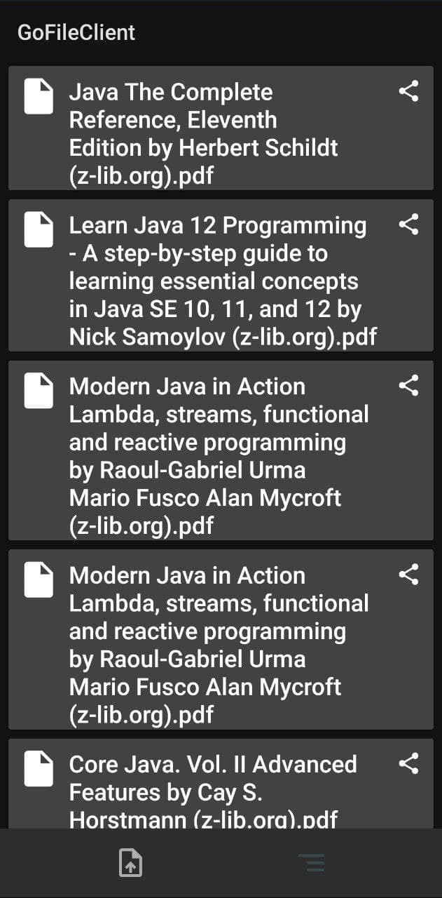

# GoFileClient

Screenshots:
------------
   

In this project:
----------------
* [MVVM][0]
* [AppCompat][1]
* [Android KTX][2]
* [Room][3]
* [ViewModel][4]
* [Fragment][5]
* [Retrofit][6]
* [RxJava3][7]
* [RxAndroid][8]
* [Kotlinx Serialization][9]

[0]: https://ru.wikipedia.org/wiki/Model-View-ViewModel
[1]: https://developer.android.com/topic/libraries/support-library/packages#v7-appcompat
[2]: https://developer.android.com/kotlin/ktx
[3]: https://developer.android.com/topic/libraries/architecture/room
[4]: https://developer.android.com/topic/libraries/architecture/viewmodel
[5]: https://developer.android.com/guide/components/fragments
[6]: https://square.github.io/retrofit/
[7]: https://github.com/ReactiveX/RxJava
[8]: https://github.com/ReactiveX/RxAndroid
[9]: https://github.com/Kotlin/kotlinx.serialization
